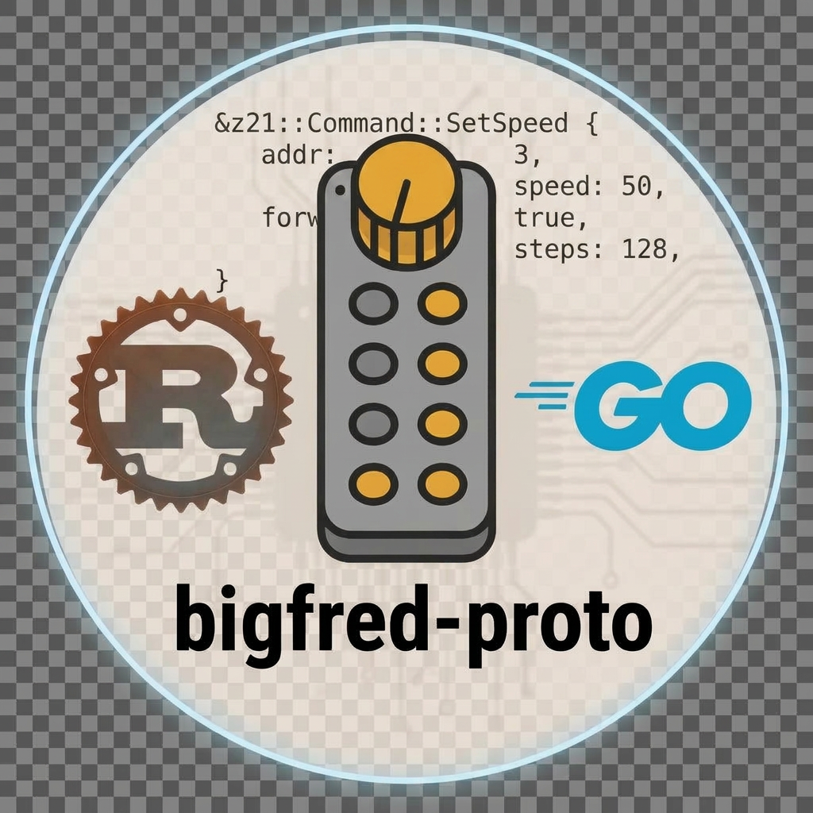

# dcc-bigfred/proto

<p align="center">
  
</p>

[](https://pkg.go.dev/github.com/dcc-bigfred/proto/go)

Libraries for talking to model-railroad command stations over **LocoNet**, **Z21 LAN**, and **WiThrottle**. Use them when you build throttles, automation, or firmware that must drive locos, toggle functions, program CVs, or switch track power — without re-implementing wire formats.

Go provides connected **clients** and test **servers** — documented on [pkg.go.dev](https://pkg.go.dev/github.com/dcc-bigfred/proto/go). Rust provides **`no_std` protocol** crates for embedded targets (LongFred); the host owns sockets. Both languages share the same [golden test vectors](testdata/).

## Features

- **Unified drive API (Go)** — `Open(uri)` then `SetSpeed`, `GetSpeed`, `SendFn`, `ListFunctions`, `EmergencyStop`, CV read/write, optional track power and LocoNet slot management
- **Three transports** — Z21 (UDP), LocoNet (serial / TCP), WiThrottle (TCP)
- **LAN autodetection (Go)** — scan a /24 for Z21, WiThrottle, and LocoNet-over-TCP
- **Protocol libraries** — frame encode/decode, checksums, WiThrottle line grammar; Rust crates are `no_std`, no `alloc`
- **Loopback servers (Go)** — Z21 UDP and WiThrottle TCP for tests and interop
- **LocoNet gateway (Go)** — fan-out upstream bus to binary/ASCII TCP listeners
- **Shared vectors** — `go run ./cmd/gen-vectors` writes `testdata/`; Go and Rust tests must match
- **CI interop** — Rust protocol crate ↔ Go `Listen` on every push
- **OpenTelemetry hooks (Go)** — optional driver metrics without OTel on the hot path

## Maturity

| Area | Go | Rust | Notes |
|------|:--:|:--:|-------|
| Z21 protocol | ✅ | ✅ | LAN frames, drive, functions, track power, CV/POM |
| Z21 `Station` client | ✅ | — | `Open("z21://…")` / `NewZ21Roco` |
| Z21 server (`Listen`) | ✅ | 🧪 | Rust crate is experimental |
| WiThrottle protocol | ✅ | ✅ | Handshake, acquire, drive, fn, e-stop, track power |
| WiThrottle `Station` client | ✅ | — | `Open("withrottle://…")` / JMRI, DCC-EX, LNWI, RB1110 |
| WiThrottle server | ✅ | 🧪 | Rust crate is experimental |
| LocoNet framing + gateway | ✅ | 🧪 | Rust gateway is a stub |
| LocoNet `Station` client | ✅ | — | `Open("serial://…" / "loconet-tcp://…" / "lbserver://…")` |
| LocoNet slot lifecycle | ✅ | — | Acquire, release, dispatch, steal |
| CV programming | ✅ | ✅ | Go: `Station` ReadCV/WriteCV (Z21+LocoNet); Rust: Z21 encode/decode + address helpers |
| Golden test vectors | ✅ | ✅ | Generated from Go |
| Usage guides | ✅ | ✅ | See [docs/](docs/) below |

✅ production-oriented in this repo · 🧪 experimental / stub · — not implemented

## Go packages ([pkg.go.dev](https://pkg.go.dev/github.com/dcc-bigfred/proto/go))

| Package | pkg.go.dev |
|---------|------------|
| Module | [github.com/dcc-bigfred/proto/go](https://pkg.go.dev/github.com/dcc-bigfred/proto/go) |
| `commandstation` | [pkgs/commandstation](https://pkg.go.dev/github.com/dcc-bigfred/proto/go/pkgs/commandstation) |
| `z21` | [pkgs/z21](https://pkg.go.dev/github.com/dcc-bigfred/proto/go/pkgs/z21) |
| `withrottle` | [pkgs/withrottle](https://pkg.go.dev/github.com/dcc-bigfred/proto/go/pkgs/withrottle) |
| `loconet` | [pkgs/loconet](https://pkg.go.dev/github.com/dcc-bigfred/proto/go/pkgs/loconet) |
| `drive` | [pkgs/drive](https://pkg.go.dev/github.com/dcc-bigfred/proto/go/pkgs/drive) |
| `telemetry` | [pkgs/telemetry](https://pkg.go.dev/github.com/dcc-bigfred/proto/go/pkgs/telemetry) |

## Documentation

| Document | Audience |
|----------|----------|
| [Go module on pkg.go.dev](https://pkg.go.dev/github.com/dcc-bigfred/proto/go) | API reference for all Go packages |
| [Go client guide](docs/go/README.md) | Connect, drive, functions, e-stop, track power |
| [Rust protocol guide](docs/rust/README.md) | `no_std` Z21 / WiThrottle from firmware or `std::net` |
| [Z21 LAN spec](docs/protos/z21.md) | Wire format reference |
| [LocoNet spec](docs/protos/loconet.md) | Opcodes and framing |
| [WiThrottle spec](docs/protos/withrottle.md) | Line protocol reference |
| [RCN-217 RailCom](docs/protos/rcn-217.md) | DCC feedback protocol (English translation) |
| [Architecture](ARCHITECTURE.md) | Repo layout, layers, equivalence |

## Consumers

This library exists for the rest of the [dcc-bigfred](https://github.com/dcc-bigfred) stack:

- **[BigFred](https://github.com/dcc-bigfred/bigfred)** — layout hub (Go). Connected `Station` clients over Z21, LocoNet, and WiThrottle ([commandstation](https://pkg.go.dev/github.com/dcc-bigfred/proto/go/pkgs/commandstation)).
- **[BigFred Wizard](https://github.com/dcc-bigfred/bigfred-wizard)** — event-tablet helper (Rust). Talks Z21 LAN when programming handsets on the layout.
- **[Programming Center](https://github.com/dcc-bigfred/programming-center)** - vendor independent decoder programming like a pro, right in your web browser.
- **[LongFred](https://github.com/dcc-bigfred/longfred)** — wireless throttle firmware (Rust `no_std`). Encodes and decodes Z21 / WiThrottle on the device; the firmware owns sockets.

## Quick start

**Go** — full client to a command station:

```bash
make -C go test
# or from the repo root: make test-go
```

```bash
go get github.com/dcc-bigfred/proto/go@v0.1.0
```

Reference: [pkg.go.dev/github.com/dcc-bigfred/proto/go](https://pkg.go.dev/github.com/dcc-bigfred/proto/go)

**Rust** — protocol crate only (no sockets):

```bash
make -C rust test
# or from the repo root: make test-rust
```

```toml
dcc-bigfred-proto-z21 = "0.1"
dcc-bigfred-proto-withrottle = "0.1"
```

Path dependency: `dcc-bigfred-proto-z21`, `dcc-bigfred-proto-withrottle` under [`rust/`](rust/).

## Releasing

Rust (crates.io) and Go (pkg.go.dev) use **different git tags**. Versions can match (`0.1.0`) but the tag names do not.

| Target | Git tag | How it is published |
|--------|---------|---------------------|
| [pkg.go.dev/github.com/dcc-bigfred/proto/go](https://pkg.go.dev/github.com/dcc-bigfred/proto/go) | `go/vX.Y.Z` | Push the tag; [go-release.yml](.github/workflows/go-release.yml) tests and pings `proxy.golang.org`. Then `go get github.com/dcc-bigfred/proto/go@vX.Y.Z`. |
| crates.io | `vX.Y.Z` | Bump `[workspace.package] version` in [`rust/Cargo.toml`](rust/Cargo.toml), commit, tag and push. [release.yml](.github/workflows/release.yml) publishes every crate without `publish = false` and creates a GitHub Release. Set repository secret `CARGO_REGISTRY_TOKEN`. |

Example: first public cut.

```bash
git tag go/v0.1.0
git push origin go/v0.1.0
# crates.io (after bumping rust/Cargo.toml):
git tag v0.1.0
git push origin v0.1.0
```

The Go module lives in subdirectory `go/`, so the git tag must be prefixed (`go/v0.1.0`) while `go get` still uses `@v0.1.0`. Until the first `go/v*` tag is fetched by the proxy, pkg.go.dev returns 404. Versions `v0.x` show a “not yet at v1” notice.

## License

Apache-2.0
