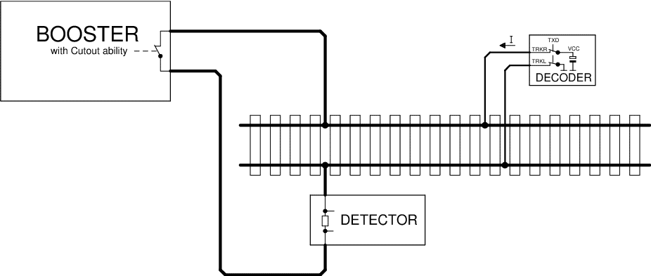
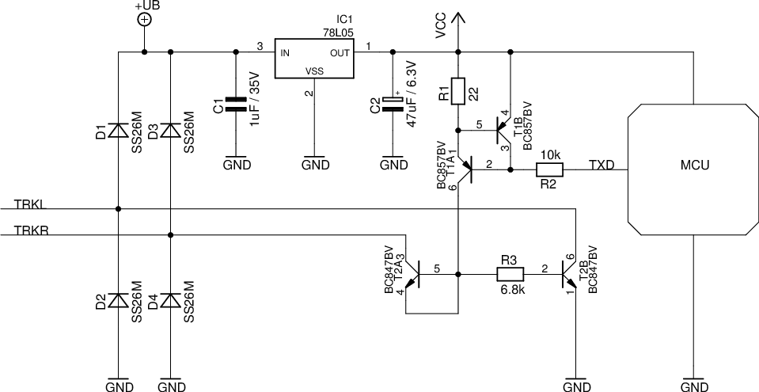
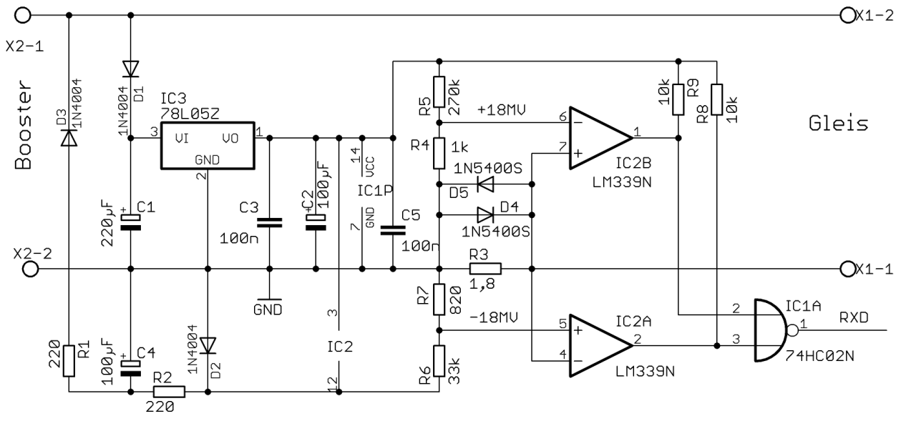
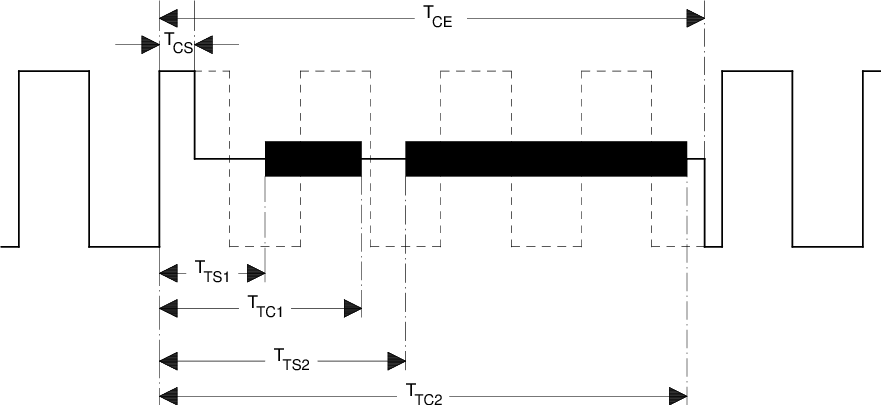
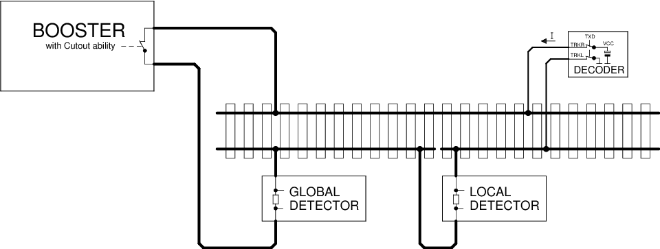

# RCN-217 RailCom — DCC Feedback Protocol

> Unofficial English translation of **RCN-217**, edition **27.07.2025**, version **1.5**.
> Source: [RCN-217_20250727.pdf](http://normen.railcommunity.de/OldVersions/RCN-217_20250727.pdf)
> (RailCommunity — Verband der Hersteller Digitaler Modellbahnprodukte e.V.).
>
> The German original is the **normative** text. This file is a working translation for
> implementers. Figures are copied from the source PDF.
>
> Conventions:
> - ► command station → decoder (DCC). Address bytes are omitted unless noted; addressing follows DCC.
> - ◄ decoder → command station (RailCom).
> - Bit-pattern boxes for DCC packets are **informative** only; the cited RCNs are authoritative.
> - Values refer to an 8-bit field unless stated otherwise. Hex values are prefixed with `0x`.
> - “RailCom” is a registered trademark of Lenz Elektronik; see §1.1.

## Contents

- [1 General](#1-general)
- [2 Physical layer](#2-physical-layer)
- [3 Packet layer](#3-packet-layer)
- [4 RailCom CVs and DCC commands](#4-railcom-cvs-and-dcc-commands)
- [5 Application layer for locomotive decoders](#5-application-layer-for-locomotive-decoders)
- [6 Application for accessory decoders](#6-application-for-accessory-decoders)
- [Annex A: References](#annex-a-references)
- [Annex B: History](#annex-b-history)

---

## 1 General

### 1.1 Purpose of the standard

This standard describes the transfer of data from a decoder over the track to a receiver, i.e. in the opposite direction to the control protocols. The transfer method described here, together with the protocol used, is called **RailCom**.

“RailCom” is a German trademark registered in the name of Lenz Elektronik for class 9 “Electronic controls” under number 301 16 303, and a U.S. trademark for classes 21, 23, 26, 36 and 38 “Electronic Controls for Model Railways” under Reg. No. 2,746,080. European patent 1 380 326 B1 has been revoked. RailCom may therefore be used freely, subject to the trademarks.

This specification applies **only** to the use of RailCom within the DCC data format (protocol). Use of RailCom within other data formats is not permitted.

### 1.2 Requirements

To conform to this standard, all technical values and protocols defined here must be observed. Tables 5 to 7 define which messages a decoder must support as a minimum.

### 1.3 Explanations

- A **DCC data packet** is a defined sequence of bits, described as a track signal in [RCN-210].
- **Bytes** are groups of eight bits.
- Each bit in a byte has a weight that depends on its position. The first bit sent, shown on the left, has the highest weight and is called MSB (“most significant bit”). Bits of a byte are numbered from the left starting at 7, decreasing to 0 on the right. The last bit sent, shown on the right, is called LSB (“least significant bit”).
- **“XF#”** denotes the binary-state control commands of [RCN-212] section 2.3.5.
- The following letters mark the meaning of a bit:

| Letter | Meaning |
| --- | --- |
| 0 | Bit value 0 |
| 1 | Bit value 1 |
| A | Address bit |
| D | Data bit |
| G | Speed |
| L | Load |
| P | Location information (position) |
| R | Direction bit |
| S | Sequence number |
| T | Type of location information |
| X | Sub-index |

Characters used in DCC commands are not listed again here.

The DCC bit combinations shown in boxes in this standard are purely informative and have no normative force. Only the cited RCNs apply.

Commands from the command station to the decoder (►) are written without addressing data. Addressing follows the DCC standard.

(◄) marks RailCom data sent from the decoder to the command station.

Unless otherwise stated, values always refer to an 8-bit field. Binary values are marked as in the list above. Hexadecimal values are prefixed with `0x`.

## 2 Physical layer

This chapter describes the physical layer of RailCom.

### 2.1 General

Information flow in a DCC system normally runs from the command station (booster) over the track to the decoders. For the reverse transfer direction this energy and data stream must be interrupted. Boosters do this by generating a so-called **RailCom cutout** at the end of every DCC packet: they disconnect both track conductors from the supply and short them together. This functional block inside the booster is called the **cutout device**. A cutout device may also be built as a separate unit outside the booster. The actual data transfer uses a current loop. The decoder must supply the required current from its internal buffer. Figure 1 shows the arrangement of booster, detector and decoder during the RailCom cutout.



**Figure 1:** RailCom principle diagram

The voltage drop across the cutout device must not exceed **10 mV** at a maximum of **34 mA** during the cutout.

### 2.2 RailCom transmitter in the decoder

To transmit a `'0'`, the decoder must supply a current *I* of **30 +4 / −6 mA**, with a voltage drop on the track of up to **2.2 V**. If high-current RailCom is enabled in CV28, the current is **60 +8 / −12 mA**, likewise with a track voltage drop of up to 2.2 V. For a `'1'`, current *I* must be at most **±0.1 mA**. The decoder’s current source must be protected against unexpected foreign voltage on the track during the cutout. Figure 2 shows a possible hardware implementation.



**Figure 2:** Symbolic representation of RailCom decoder hardware

Explanation of the schematic:

The RailCom part consists only of resistors R1 to R3 and transistors T1A to T2B. T1A and T1B form a current source; T2A is wired as a diode and protects the current source from positive voltages above Vcc.

All other parts of the circuit belong to the decoder’s normal hardware. Note the extremely small hardware effort for the RailCom transmitter.

It is recommended that the feed is arranged so that the **positive pole is on the right-hand rail in the forward direction of travel**. This allows the vehicle’s orientation on the track to be detected. There are situations where this recommendation cannot be followed. ID 3 on channel 1 was therefore added (section 5.2.2).

Orientation detection works, by principle, only in a **two-rail two-conductor** system. In a three-rail two-conductor system (“Märklin”) and a three-rail three-conductor system (“Trix Express”), placement orientation cannot be detected from the polarity of the RailCom or track signal — neither by the recommendation here nor via ID 3 on channel 1.

### 2.3 The RailCom detector

A detector must interpret a current **greater than 10 mA** during the middle 50% of the bit time as `'0'`, and a current **less than 6 mA** during the middle 50% of the bit time as `'1'`. The voltage drop across the detector must not exceed **200 mV** at a maximum of **34 mA** during the cutout. Figure 3 shows a possible hardware implementation.



**Figure 3:** Example of simple RailCom detector hardware

At most **two detectors** (including the global detector) may be used in series. The local detector should provide a connection for external occupancy evaluation. If it does not, any occupancy detectors used externally must be specified for RailCom.

Explanation:

These circuits (transmitter and detector) were tested on large club layouts over distances of up to **100 m**. That distance was bridged without difficulty. Loads of **5 Ω** that are **not** isolated from the track by a bridge rectifier, and that sit in parallel with the detector’s sense resistor, are permitted.

5 Ω at a track voltage of 15 V corresponds to a current of 3 A.

Incandescent lamps (PTC loads) must always be operated through a fast bridge rectifier (**&lt; 500 ns**).

### 2.4 Timing

Up to **8 bytes** of data can be transferred in one cutout. Each transmitted byte starts with a start bit (`'0'`), followed by the 8 data bits (**least-significant bit first**), and ends with a stop bit (`'1'`). The bit rate is **250 kbit/s ±2%**. Rise time (10% → 90%) and fall time (90% → 10%) must not exceed **0.5 µs**.

The RailCom cutout is split into two channels. Channel 1 can transfer **2 bytes**; channel 2 up to **6 bytes**. Figure 4 shows the timing diagram. All times are referred to the **zero crossing of the last edge of the packet end bit**.



**Figure 4:** RailCom timing. \*) The detector should already be ready to receive channel 1 at **75 µs**.

**Table 1: Timing parameters**

| Parameter | Name | Min | Max |
| --- | --- | --- | --- |
| Cutout start | TCS | 26 µs | 32 µs |
| Cutout end | TCE | 454 µs | 488 µs |
| Start channel 1 | TTS1 | 80 µs \*) | |
| End channel 1 | TTC1 | | 177 µs |
| Start channel 2 | TTS2 | 193 µs | |
| End channel 2 | TTC2 | | 454 µs |

\*) The detector should already be ready to receive channel 1 at 75 µs.

**Remark**

The figure above shows RailCom timing with `'1'` bits of 2×58 µs (nominal DCC `'1'` bit). With shorter `'1'` bits the cutout may extend into the 5th `'1'` bit. That is not a problem: a command station must send at least 4 + 12 = **16 sync bits** as per [RCN-211] (not counting the packet end bit of the previous DCC packet), so the decoder sees enough sync bits (at least 12 sync bits must be sent; 10 are required for the decoder to recognise the packet).

A cutout of about **450 µs** must not affect a decoder that does not support RailCom. On a real model railway, power interruptions of up to **20 ms** have been observed, so a decoder should be able to handle a power interruption of that order.

### 2.5 Data protection

Data transfer is protected by **4-of-8 encoding**: every transmitted byte contains four `'1'` bits and four `'0'` bits (Hamming weight 4). If this ratio is violated, a transfer error has occurred.

There are 70 different bit combinations in a byte with Hamming weight 4. Of these, **64** are used to transfer 6 payload bits; of the remaining 6, three are used for short special messages — 2× ACK and NACK. The remaining three combinations are unused at present.

Net payload: **12 bits** on channel 1, up to **36 bits** on channel 2.

**Table 2: Encodings in the 4-of-8 code**

| Value | Code | Value | Code | Value | Code | Value | Code |
| --- | --- | --- | --- | --- | --- | --- | --- |
| 0x00 | 10101100 | 0x10 | 10110010 | 0x20 | 01010110 | 0x30 | 11000110 |
| 0x01 | 10101010 | 0x11 | 10110100 | 0x21 | 01001110 | 0x31 | 11001100 |
| 0x02 | 10101001 | 0x12 | 10111000 | 0x22 | 01001101 | 0x32 | 01111000 |
| 0x03 | 10100101 | 0x13 | 01110100 | 0x23 | 01001011 | 0x33 | 00010111 |
| 0x04 | 10100011 | 0x14 | 01110010 | 0x24 | 01000111 | 0x34 | 00011011 |
| 0x05 | 10100110 | 0x15 | 01101100 | 0x25 | 01110001 | 0x35 | 00011101 |
| 0x06 | 10011100 | 0x16 | 01101010 | 0x26 | 11101000 | 0x36 | 00011110 |
| 0x07 | 10011010 | 0x17 | 01101001 | 0x27 | 11100100 | 0x37 | 00101110 |
| 0x08 | 10011001 | 0x18 | 01100101 | 0x28 | 11100010 | 0x38 | 00110110 |
| 0x09 | 10010101 | 0x19 | 01100011 | 0x29 | 11010001 | 0x39 | 00111010 |
| 0x0A | 10010011 | 0x1A | 01100110 | 0x2A | 11001001 | 0x3A | 00100111 |
| 0x0B | 10010110 | 0x1B | 01011100 | 0x2B | 11000101 | 0x3B | 00101011 |
| 0x0C | 10001110 | 0x1C | 01011010 | 0x2C | 11011000 | 0x3C | 00101101 |
| 0x0D | 10001101 | 0x1D | 01011001 | 0x2D | 11010100 | 0x3D | 00110101 |
| 0x0E | 10001011 | 0x1E | 01010101 | 0x2E | 11010010 | 0x3E | 00111001 |
| 0x0F | 10110001 | 0x1F | 01010011 | 0x2F | 11001010 | 0x3F | 00110011 |
| ACK | 00001111 | | | “Command understood and will be executed” or “YES” | | | |
| ACK | 11110000 | | | “Command understood and will be executed” or “YES” | | | |
| reserved | 11100001 | | | | | | |
| reserved | 11000011 | | | | | | |
| reserved | 10000111 | | | | | | |
| NACK | 00111100 | | | “Command or CV is not supported” — optional | | | |

**Explanation of NACK**

This optional reply can mark a command that is not supported. Recognition of an unsupported command refers **only to the first command byte**. With POM, a NACK may also be sent (independently of the reply to unimplemented commands) to mark a **non-existent CV**. So that the POM command itself is not wrongly treated as unsupported, a NACK must **not** be sent as the first reply to a POM command. That is: when accessing a non-existent CV the decoder first replies with ACK and then with NACK. ACK and NACK may be sent together in the same channel 2.

## 3 Packet layer

This chapter describes the structure of RailCom packets.

RailCom packets (called **datagrams** below) have a payload length of 6, 12, 18, 24 or 36 bits. Channel 1 can transfer only a **12-bit datagram**. Channel 2 can transfer any combination of datagrams with a maximum total length of **36 bits**.

The data channel may optionally be padded to 36 bits with ACK.

Datagrams (except ACK and NACK) begin, unless otherwise stated, with a **4-bit identifier**, followed by 8, 14, 20 or 32 payload bits, transferred as follows:

**Table 3: Datagram structure**

| Datagram | Bytes |
| --- | --- |
| 12 bit | ID[3-0] D[7-6] + D[5-0] |
| 18 bit | ID[3-0] D[13-12] + D[11-6] + D[5-0] |
| 24 bit | ID[3-0] D[19-18] + D[17-12] + D[11-6] + D[5-0] |
| 36 bit | ID[3-0] D[31-30] + D[29-24] + D[23-18] + D[17-12] + D[11-6] + D[5-0] |

Datagram length is determined by the identifier (see chapters 3.1 and 3.2).

For automatic decoder logon the two data channels may be **combined (channel bundling)**. Channel timing is unchanged, but a single data block of **48 bits** is sent — including an identifier depending on context. The structure of that block is defined in [RCN-218].

Mobile decoders (locomotive decoders) and stationary decoders (accessory decoders) have different feedback requirements. The channels are therefore used differently for the two decoder types. The meaning of datagrams thus depends on the address of the preceding DCC packet. The RailCom command types **MOB** (mobile) and **STAT** (stationary) are distinguished by the DCC address ranges defined in [RCN-211] section 3:

**Table 4: DCC address ranges for command types**

| DCC address byte 1 | DCC address byte 2 | Data in channel 1 | DCC / RailCom command type |
| --- | --- | --- | --- |
| 0 | | none | Locomotive-decoder broadcast |
| 1–127 | | ID 1, ID 2 | MOB (locomotive decoder) short address |
| 128–191 | | SRQ | STAT (accessory decoder) — **no identifier** |
| 192–231 | ADR low | ID 1, ID 2 | MOB (locomotive decoder) long address. Long address 0 is also used as the programming address (section 5.2.4). |
| 232–252 | | none | Reserved |
| 253 | | none | Used for data transfer per NMRA [S-9.2.1.1]. Addressing uses the DCC address in a packed format. |
| 254 | | channel bundling | Used for automatic logon per [RCN-218] — identifier is context-dependent. For addressed commands, addressing uses the Unique ID. |
| 255 | | ID 14, ID 15 with RailComPlus® | 255 is the idle-packet address (`0xFF - 0x00 - 0xFF`). A first data byte other than 0 marks use within RailComPlus®. In that case the packet always consists of more than 3 bytes. |

Decoders must **not** send feedback on the idle packet or on service-mode packets. Only the decoder addressed by the DCC packet may transmit on **channel 2**. To allow channel-1 feedback while no DCC locomotive address is yet being addressed, it is recommended that DCC locomotive address **10239** is addressed alternately with the idle packet.

After a command to address **254**, either for automatic logon with DCC-A per [RCN-218] or per [S-9.2.1.1], channels 1 and 2 are bundled and identifiers are used depending on context. Feedback after commands to addresses **253** and **255** is specified in NMRA [S-9.2.1.1] or in the RailComPlus® specification.

### 3.1 RailCom command type MOB

Mobile locomotive decoders use **channel 1** for fast localisation on the layout (see `app:adr`). After every DCC packet addressed to a locomotive decoder (marked MOB in Table 4) they must send their DCC address, which is then received by local detectors on the layout. Exempted are programming-mode packets from the moment the decoder recognises programming mode. Transmission after every locomotive-decoder DCC packet (short address 1…127, long address 1…10239) is required so that, with several transmitters in a section, fragments of different addresses are not wrongly assembled into a false, non-existent address.

**Channel 2** may be used only by the addressed decoder and carries decoder information. An addressed decoder must always send a reply on channel 2 (ACK if necessary) to confirm error-free reception of the DCC packet. A channel-2 reply signals that the decoder received the command without error, **not** that the decoder accepted and executed the command.

The following identifiers (datagrams) are defined for locomotive decoders. All IDs not listed are reserved.

**Table 5: Command type MOB identifiers (datagrams) on channel 1**

| ID | Channel 1 | Remark |
| --- | --- | --- |
| 1 | `app:adr_high` | mandatory |
| 2 | `app:adr_low` | mandatory |
| 3 | `app:info1` | optional, enabled via CV28 bit 3 |
| 14 | RailComPlus | No longer available to RailCommunity |
| 15 | RailComPlus | No longer available to RailCommunity |

**Table 6: Command type MOB identifiers (datagrams) on channel 2**

| ID | Channel 2 | Length | Remark | Command-related |
| --- | --- | --- | --- | --- |
| 0 | `app:pom` | 12 bit | Mandatory, 1 byte | yes, POM [RCN-214] |
| 1 | `app:adr_high` | 12 bit | optional for re-railing search | yes, re-railing search XF2 |
| 2 | `app:adr_low` | 12 bit | optional for re-railing search | yes, re-railing search XF2 |
| 3 | `app:ext` | 18 bit | optional | yes, location information XF1 |
| 4 | `app:info` | 36 bit | reserved for current running information | no |
| 7 | `app:dyn` | 18 bit (possibly twice) | optional | no¹ |
| 8 | `app:xpom` | 36 bit | optional | yes, XPOM [RCN-214] |
| 9 | `app:xpom` | 36 bit | optional | yes, XPOM [RCN-214] |
| 10 | `app:xpom` | 36 bit | optional | yes, XPOM [RCN-214] |
| 11 | `app:xpom` | 36 bit | optional | yes, XPOM [RCN-214] |
| 12 | `app:CV-auto` | 36 bit | Automatic transfer of CVs | no |
| 13 | `app:block` | 36 bit | optional, see [TN-217] | no |
| 14 | `app:zeit` | 12 bit | optional for re-railing search | yes, re-railing search XF2 |

¹ No command has yet been defined to request a specific DV. This remains possible in order to save IDs, and may be specified in future.

- **“mandatory”** means a complete implementation.
- **“optional”** means either a complete implementation, or a partial implementation under the conditions in §4.1.
- **“Command-related”**: if “yes”, channel-2 messages may follow only the corresponding command; if “no”, they may follow any command to the decoder. These non-command-related replies also count as ACK.

**Remark**

Older decoders occupied various identifiers during a test phase that are now marked “reserved”. Newer decoders must store the RailCom version number in a dedicated CV (see “RailCom CVs”). That can be used for discrimination. Older decoders without a version number should be updated.

If several datagrams are sent on channel 2, they must be sent in this ID order:

`1 2 0 3 4 7 8 9 10 11 13 14 5 6 15 12`

This is the order in which the IDs were defined. It allows older detectors to evaluate the datagrams they know. If an older datagram follows a newer one, an older detector cannot evaluate any datagram because it does not know the length of the first, newer datagram. ACK or NACK must not lead, because after an ACK or NACK all further data may be ignored.

### 3.2 RailCom command type STAT

Accessory decoders use **channel 1** to report service-request (see `app:srq`). After every DCC packet addressed to an accessory decoder (marked STAT in Table 4) they may send their identity (12-bit address) — a 12-bit value **without identifier** (not when addressing via decoder ID). If several decoders report at once, a search must be started.

Service requests are optional.

**Channel 2** may be used only by the addressed decoder and carries decoder information. An addressed decoder must always send a reply on channel 2 (ACK if necessary) to confirm error-free reception of the DCC packet.

A channel-2 reply signals that the decoder received the command without error, **not** that the decoder accepted and executed the command.

The following identifiers (datagrams) on channel 2 are defined for accessory decoders. All IDs not listed are reserved.

**Table 7: Command type STAT identifiers (datagrams) on channel 2**

| ID | Channel 2 | Length | Remark | Command-related |
| --- | --- | --- | --- | --- |
| 0 | `app:pom` | 12 bit | optional | yes, POM [RCN-214] |
| 3 | `app:stat4` | 36 bit | optional | no |
| 4 | `app:stat1` | 12 bit | mandatory | no |
| 5 | `app:zeit` | 12 bit | optional | no |
| 6 | `app:fehler` | 12 bit | mandatory | no |
| 7 | `app:dyn` | 18 bit (possibly twice) | optional | no² |
| 8 | `app:xpom` (formerly `stat2`) | 36 bit | optional | no |
| 9 | `app:xpom` | 36 bit | optional | no |
| 10 | `app:xpom` | 36 bit | optional | no |
| 11 | `app:xpom` | 36 bit | optional | no |
| 12 | `app:` Test Feature ID | variable | optional | n/a |
| 13 | `app:block` | 36 bit | optional | (not yet defined) |

² See footnote 1 in Table 6.

- **“mandatory”** → complete implementation
- **“optional”** → complete implementation, or partial implementation under the conditions in §4.1
- **“Command-related”**: if “yes”, channel-2 messages may follow only the corresponding command; if “no”, they may follow any command to the decoder. These non-command-related replies also count as ACK.

## 4 RailCom CVs and DCC commands

### 4.1 System requirements

This RailCom specification is designed to be **backwards compatible**: non-RailCom decoders can continue to operate, and non-RailCom command stations can continue to control RailCom-capable decoders.

Driving analogue vehicles (locomotives without a decoder) using a stretched `'0'` is **not permitted**.

Decoders with a RailCom implementation must support at least the following replies: **ACK**; locomotive decoders additionally `app:adr_high` and `app:adr_low` on channel 1 and `app:pom` on channel 2; accessory decoders additionally `app:stat1` and `app:fehler`.

On every locomotive or turnout addressing, the decoder must reply in channel 2 of the cutout (see applications). The decoder must **never** reply if it was not addressed, or if the command was sent to broadcast address 0.

### 4.2 CVs

All CVs shown here are **informational**. The binding definition is in [RCN-225].

#### 4.2.1 CV28 RailCom configuration

**Table 8: RailCom configuration**

| Bit | Function | |
| --- | --- | --- |
| 0 | Channel 1 for address broadcast (section 5.2) | 1 = enabled, 0 = disabled |
| 1 | Channel 2 for data and acknowledge | 1 = enabled, 0 = disabled |
| 2 | Automatically disable channel 1 (section 5.2.1) | 1 = enabled, 0 = disabled |
| 3 | Send ID 3 on channel 1 (section 5.2.2) | 1 = enabled, 0 = disabled |
| 4 | Programming address 0000 (long address 0) (section 5.2.4) | 1 = enabled, 0 = disabled |
| 5 | reserved | |
| 6 | Enable high-current RailCom (section 2.2) | 1 = enabled, 0 = disabled |
| 7 | Enable automatic logon | 1 = enabled, 0 = disabled |

Bits 0, 2 and 3 apply only to locomotive decoders, not to accessory decoders.

For compatibility with previous behaviour, CV28 bit 2 should be **0** when a decoder is shipped. On shipment, bit 0 should be **1** for locomotive decoders and **0** for accessory decoders, and bit 1 should be **1** for all decoders. For automatic logon via address 254 per [RCN-218], channel 1 is **always** enabled.

#### 4.2.2 CV29

Used as per [RCN-225].

#### 4.2.3 CV31, CV32

Used as a pointer as per [RCN-225].

#### 4.2.4 RailCom block

CV31 = 0 and CV32 = 255 address a block of 256 CVs allocated to RailCom applications as follows:

**Table 9: Allocation of block 255**

| Byte | Allocation | m/o | Access |
| --- | --- | --- | --- |
| 0–1 | Manufacturer ID (per NMRA [S-9.2.2 Appendix A], little-endian). Byte 0 thus corresponds to CV 8, or with a long manufacturer ID to CV 108, and byte 1 to CV 107. | m | R |
| 4–7 | Product ID (manufacturer-specific product identifier, to distinguish individual products. Little-endian) | o | R |
| 8–11 | MUN (Manufacturer Unique Number. Little-endian). 4-byte serial number across all devices of a manufacturer. | o | R |
| 12–15 | Production date (number of seconds since 1 Jan 2000, little-endian, unsigned) | o | R |
| 16–63 | Manufacturer-specific allocation possible | o | R/W |
| 64–127 | Dynamic variables per APP DYN, section 5.5, Table 13, where the range CV72 = DV 8 to CV83 = DV 19 corresponds to tanks 1 to 12. Other DVs may be reset by writing the CV. | o | R/W |
| 128 | RailCom version number “before the point”, binary | m | R |
| 129 | RailCom version number “after the point”, binary | m | R |
| 130 | Feature number for Test Feature ID (see §5.7) | o | R |
| 131 | reserved | | |
| 132 | specific consumption, tank 1 | o | R/W |
| 133 | specific consumption, tank 2 | o | R/W |
| 134 | specific consumption, tank 3 | o | R/W |
| 135 | specific consumption, tank 4 | o | R/W |
| 136 | specific consumption, tank 5 | o | R/W |
| 137 | specific consumption, tank 6 | o | R/W |
| 138 | specific consumption, tank 7 | o | R/W |
| 139 | specific consumption, tank 8 | o | R/W |
| 140 | specific consumption, tank 9 | o | R/W |
| 141 | specific consumption, tank 10 | o | R/W |
| 142 | specific consumption, tank 11 | o | R/W |
| 143 | specific consumption, tank 12 | o | R/W |
| 144 | Fill level of all tanks (0…100); a write to this CV sets the contents of all tanks to the given value. | o | W |
| 145 | Speedometer scaling in the command station; value × 2 = maximum speed in km/h | o | R/W |
| 146–255 | reserved | | |

m = mandatory, o = optional, R = read, W = write

### 4.3 DCC commands

The extra functionality of RailCom also requires additional DCC commands. These include:

#### 4.3.1 Additional function commands

RailCom adds functions such as search, re-railing search, etc. (see also “Application layer for locomotive decoders”). The short-form binary-state control commands of [RCN-212] section 2.3.5 are used for this.

**Operations command: binary-state control as a RailCom command**

- ► Short binary-state control command as per [RCN-212] section 2.3.5 — `1101-1101 DLLL-LLLL`

These commands are designated **XF1 to XF127** in this standard.

Of these, [RCN-212] reserves the first 28 for special applications such as RailCom. The first 15 commands are provided for RailCom.

**Table 10: Function numbers**

| XF | Function |
| --- | --- |
| 1 | Request location information as per section 5.3.1 |
| 2 | Re-railing search |
| 3 | Output all CVs with CV-Auto ID 12 |
| 4–15 | reserved |

#### 4.3.2 Extended programming commands

[RCN-214] section 3 also defines the configuration-variable access command — **short form** — for programming CVs. This also allows two defined CV pairs to be written:

`KKKK = 0100` = write CV17 (first data byte) and CV18 (second data byte) (extended address) simultaneously, and set bit 5 in CV29.

Feedback is on the **old** address via two consecutive datagrams with ID 0: first the first data byte, then the second. Both datagrams must be sent in the same channel 2, i.e. 12-bit datagram + 12-bit datagram.

**Operations command: POM**

- ► CV access write of CV17 and CV18 as per [RCN-214] §3 — `1111-0100`
- ◄ Channel 2: `0000` (ID 0) `DDDD-DDDD` + `0000` (ID 0) `DDDD-DDDD` with D = CV data, first CV17 then CV18

`KKKK = 0101` = write CV31 (first data byte) and CV32 (second data byte) (pointer value for the extended range, high byte (31) and low byte (32)).

Feedback is via two consecutive datagrams with ID 0: first the first data byte, then the second. Both datagrams must be sent in the same channel 2, i.e. 12-bit datagram + 12-bit datagram.

**Operations command: POM**

- ► CV access write of CV31 and CV32 as per [RCN-214] §3 — `1111-0101`
- ◄ Channel 2: `0000` (ID 0) `DDDD-DDDD` + `0000` (ID 0) `DDDD-DDDD` with D = CV data, first CV31 then CV32

#### 4.3.3 NOP for accessory decoders

Accessory decoders report after a switching command if they want to tell the command station something (SRQ).

Switching commands are usually sent only sporadically, so accessory decoders could make themselves known equally rarely. [RCN-213] section 2.5 therefore defines the **NOP** command, which is sent regularly but initially does nothing except allow accessory decoders an SRQ.

Non-RailCom basic and extended accessory decoders must recognise this as invalid and ignore it. It serves, first, to let accessory decoders issue an SRQ in the following cutout; second, if several decoders report an SRQ at once, it allows a search for the participating decoders.

This is achieved by transferring an accessory-decoder address with the NOP. Only those decoders whose address is **less than or equal to** the address in the NOP then report. With reports from several decoders, successive approximation can identify and serve the decoder with the lower address. The search is repeated until no decoder reports.

**Operations command: NOP**

- ► NOP for accessory decoders as per [RCN-213] section 2.5 — `10AA-AAAA 0AAA-1AAT`

For regular polling of all accessory decoders, the command station should send a NOP with the **highest possible address**, so that all decoders are addressed.

As long as only one decoder ever reports with an SRQ, that NOP with the highest address can remain. Only when several decoders report at once must the command station start a search by varying the address in the NOP.

A RailCom-capable command station must send a NOP at intervals to poll accessory decoders. The interval between two NOPs is a compromise between DCC-signal bandwidth and SRQ reaction time. An interval of about **0.5 seconds** is recommended.

During searches after multiple reports, the NOPs used for the search must of course be sent as quickly as possible one after another.

## 5 Application layer for locomotive decoders

The following sections describe the commands for RailCom functionality for locomotive decoders in the address ranges marked MOB in Table 4.

### 5.1 POM (ID 0)

POM means **Programming On the Main**, i.e. programming on the running track. It is used to read and write configuration variables in operations mode as per [RCN-214] section 2. These commands are answered on channel 2 with a 12-bit datagram with ID 0 = `0000` and 8 data bits. The data bits contain the CV value.

**Operations command: POM**

- ► Access to bytes or bits as per [RCN-214] section 2 — `1110-KKVV VVVV-VVVV DDDD-DDDD` / `1110-10VV VVVV-VVVV 111K-DBBB`
- ◄ Channel 2: `0000` (ID 0) `DDDD-DDDD` with D = CV data

#### 5.1.1 Byte read

**Operations command: POM byte read**

- ► Byte read as per [RCN-214] section 2 — `1110-01VV VVVV-VVVV DDDD-DDDD`
- ◄ Channel 2 (12 bit): `0000` (ID 0) `DDDD-DDDD` with D = CV data

The corresponding reply datagram (ID 0) need not be sent in the same packet frame; it may occur later. A command station must therefore ensure that the decoder is addressed again and that no other programming command is sent to the same address beforehand (the same command is allowed).

When the read has finished, the decoder sends the result in response to the corresponding repeated read command. If the decoder does not return the data within **0.5 s**, the read is considered failed.

#### 5.1.2 Byte write

**Operations command: POM byte write**

- ► Byte write as per [RCN-214] section 2 — `1110-11VV VVVV-VVVV DDDD-DDDD`
- ◄ Channel 2 (12 bit): `0000` (ID 0) `DDDD-DDDD` — D is the CV data value present in the CV after the POM operation.

When writing, the decoder should reply as follows:

- with ACK while the new value has not yet been written;
- with the new value if the new value was written successfully;
- with ACK followed by NACK within one RailCom message if the CV is not supported, or with a different value if the written value cannot be accepted.

Instead of ACK, another non-command-related message may be sent.

If the decoder does not return a value within **0.5 s**, the write is considered failed. For a read-only CV the decoder returns the current CV value.

#### 5.1.3 Bit write

**Operations command: POM bit write**

- ► Bit write as per [RCN-214] section 2 — `1110-10VV VVVV-VVVV 1111-DBBB`
- ◄ Channel 2 (12 bit): `0000` (ID 0) `DDDD-DDDD` — D is the CV data value present in the CV after the POM operation.

Replies as for “Byte write”. The bit-read command is of no interest for RailCom, because the whole byte is always reported back.

### 5.2 ADR (IDs 1 & 2)

This feedback is used to determine the addresses of locomotive decoders on the layout. With fixed detectors it can be used for localisation.

Locomotive decoders use channel 1 as a **broadcast channel** for their own address. In the cutout after every DCC packet addressed to a locomotive decoder (see MOB in Table 4) they send their **active address** (base, extended, consist, or if applicable DCC-A address). The following 12-bit datagrams with ID 1 and ID 2 are defined; a DCC-A address is transferred like the base or extended address:

**Table 11: ADR address mapping**

| ADR1 (ID 1) | ADR2 (ID 2) | Address |
| --- | --- | --- |
| `0 0 0 0 0 0 0 0` | `0 A6 A5 A4 A3 A2 A1 A0` | Base address (CV1) |
| `0 1 1 0 0 0 0 0` | `R A6 A5 A4 A3 A2 A1 A0` | Consist address (CV19) |
| `1 0 A13 A12 A11 A10 A9 A8` | `A7 A6 A5 A4 A3 A2 A1 A0` | Extended address (CV17+CV18) |

Long consist addresses (CVs 19 and 20) are sent like normal long addresses.

A decoder must send the two datagrams ADR1 and ADR2 **alternately**, depending on its active address. The “active address” is the one under which the decoder receives its drive commands.

**Operations-command reply: ADR**

- ► Operations command to a locomotive decoder as per [RCN-212] section 2
- ◄ Channel 1: `0001` (ID 1) ADR1 or `0010` (ID 2) ADR2

**Possible application**

Local detectors on the layout evaluate these datagrams promptly and forward the information (command station, computer, etc.). The command station can thus learn which decoder is on a given track section. Figure 5 shows this schematically.

This method is particularly suitable for train control.



**Figure 5:** Localisation of locomotive decoders

Localisation of a decoder as above can only work if that decoder is **alone** on the track section monitored by the local detector. This is a problem in multi-unit (consist) operation. It is recommended that only the **leading locomotive** sends ADR datagrams on channel 1, while this function is disabled via CV28 on the following locomotives. That can be done via POM when assembling the consist.

#### 5.2.1 Dynamic channel-1 use

Here, sending the address on channel 1 is switched off automatically to reduce collisions. The decoder sends on channel 1:

- after a restart;
- after an address change;
- if it has not been addressed for more than **5 s**.

If CV28 bit 2 is set, transmission on channel 1 is switched off automatically after the decoder’s own locomotive address has been received **eight times**. A new locomotive is thus recognised and, once the system has addressed it, no longer disturbs recognition of further locomotives.

#### 5.2.2 Info1 (ID 3)

To give a local detector further information, the decoder may also send ID 3 cyclically on channel 1 in addition to IDs 1 and 2, i.e. ID 1, ID 2, ID 3, ID 1, … in sequence. This must be enabled via CV28 bit 3. The conditions for IDs 1 and 2 also apply: ID 3 may be sent only if IDs 1 and 2 are enabled on channel 1, and only in the cutout after a DCC packet addressed to a locomotive decoder.

**Table 12: Meaning of ID 3 on channel 1**

| Bit | Function |
| --- | --- |
| 0 | Placement orientation = polarity of the track signal as per [RCN-210] section 2.3. 1 = positive, 0 = negative |
| 1 | Direction of travel = polarity of the track signal referred to the direction of travel rather than to the decoder connections, including CV29 bit 1 and if applicable CV19 bit 7 (corresponds to bit 1 “OW” in DV 27). 1 = negative, 0 = positive |
| 2 | Running state. 1 = moving, 0 = standing |
| 3 | 1 = part of a consist |
| 4 | 1 = request to be addressed so that a message can be sent on channel 2 |
| 5–7 | reserved |

#### 5.2.3 Re-railing search (IDs 1, 2 and 14)

This is a special application for identifying a vehicle on the layout. The vehicle is briefly disconnected from track voltage by tipping it or by another means. The disconnection must last at least **1 second**. After the decoder has power again, it replies for at most **30 seconds** to the command **“XF2 off”** at broadcast address 0 with its address on channel 2. During that time the user must trigger this command via the command station.

**Operations-command reply: ADR / ZEIT (time)**

- ► Search command: short binary-state control command “XF2 off” as per [RCN-212] section 2.3.5 to broadcast address 0 — `1101-1101 0000-0010`
- ◄ Channel 2 from the decoder: three 12-bit datagrams
  - `0001` (ID 1) `DDDD-DDDD`: `adr_high` as per Table 11
  - `0010` (ID 2) `DDDD-DDDD`: `adr_low` as per Table 11
  - `1110` (ID 14) `DDDD-DDDD`: time in seconds from when the decoder had power again until reception of the **first** search command, whether or not it answers that command.

The decoder should not answer every “XF2 off” to broadcast address 0, but **statistically** (average probability about **1:8**), so that the re-railing search can also recognise and list several vehicles placed on the track at the same time (i.e. in close succession). False reports may occur (vehicles with random brief contact interruptions); the time values (return of voltage until reception of the first search command) can help with recognition.

The decoder should (statistically) answer “XF2 off” commands only as long as the sequence of “XF2 off” commands is not interrupted for more than **1 second**, i.e. the time difference between two received “XF2 off” commands is not greater than 1 second.

It is recommended that “XF2 off” is sent about **8 times per second**.

#### 5.2.4 Decoder logon via programming address 0000

This is a very simple method for detecting (new) decoders on the layout. It can be used with a global RailCom detector or, preferably, a local one. With this method only **one** decoder can be recognised at a time.

The command station sends a special logon command every **2 to 3 seconds**. It consists of 14-bit locomotive address **“0”** with a POM read of **CV29**. Only decoders with logon bit **4** set in **CV28** may answer this command.

If, despite CV28 bit 4 being set, the decoder sees no logon command within **5 seconds**, it enters normal operations mode. Until then it ignores its address.

The command station evaluates the received contents of CV29. Depending on the result it then also reads, via POM, the 7-bit or 14-bit locomotive address. If bit 7 in CV29 is set, it may also read the 11-bit accessory address.

In dialogue with the user the new decoder is taken into the internal database permanently or temporarily. If short locomotive address **3** or accessory address **1** was read, a suggestion for a new address assignment may be made. Likewise if the read address is already stored for another vehicle in the database.

After logon has finished, bit 4 in **CV29** should be cleared automatically by the command station.

If this logon method is supported, bit 4 in CV28 should be set from the factory and also set on a decoder reset by programming CV 8 to 8. To set bit 4 in CV28, besides the normal programming methods, a special value written to CV 8 may also be used.

### 5.3 EXT (ID 3)

This feedback transfers location information. The location of the locomotive decoder of a given address can thus be determined, and refilling of supplies can be triggered if required.

#### 5.3.1 Sending location information

Location information may be sent by the decoder or by the detector, depending on where the information is held.

**Case 1:** Location information is held in the decoder (e.g. by infrared transfer).

**Operations-command reply: EXT**

- ► Short binary-state control command “XF1 off” as per [RCN-212] section 2.3.5 — `1101-1101 0000-0001`
- ◄ Channel 2 from the decoder: `0011` (ID 3) `00 TTTT-PPPP-PPPP`
  - `TTTT = 0000` – `0111`: location information (position): `0PPP`
  - `TTTT = 1000` – `1111`: reserved
  - `0PPP-PPPP-PPPP`: 11-bit location address (position)

If the location information is held in the decoder, it may also be sent spontaneously on channel 2 with the DYN ID. See section 5.5.

**Case 2:** Location information is held in the detector.

**Operations-command reply: EXT**

- ► Short binary-state control command “XF1 off” as per [RCN-212] section 2.3.5 — `1101-1101 0000-0001`
- ◄ Channel 2 from the decoder: `0011` (ID 3) `01`
- ◄ Channel 2 from the detector: `TTTT-PPPP-PPPP`

| TTTT | Meaning |
| --- | --- |
| 0000–0111 | location information only |
| 1000 | reserved |
| 1001 | reserved |
| 1010 | diesel filling station |
| 1011 | coal bunker |
| 1100 | water crane |
| 1101 | sanding plant |
| 1110 | charging station (battery) |
| 1111 | general filling station |

`PPPP-PPPP`: 8-bit location address (position)

The detector works as in Figure 5, but is supplemented with a RailCom transmitter. Because the location information is sent back over the track, no further connection to e.g. a bus system is required.

#### 5.3.2 Refilling

Filling one tank or all tanks is done with the “Byte write” command of section 5.1.2 on the corresponding CVs in the RailCom block (CV31=0 & CV32=255).

### 5.4 Current running information (ID 4)

This message is intended to transfer current running-state information from the decoder to the command station on the decoder’s initiative. Unlike DYN (ID 7), **32 bits** instead of 8 can be transferred in one datagram. Because there is not yet a detailed specification, ID 4 is currently only **reserved**.

### 5.5 DYN (ID 7)

This feedback transfers dynamic information from locomotive decoders. “Dynamic information” means **dynamic variables (DVs)** that change during operation (e.g. speed, tank contents). RailCom CVs 64–127 (see section 4.2.4, Table 9) correspond to DVs that can be changed by programming.

**Operations-command reply: DYN**

- ► Operations command to the decoder address as per [RCN-212] section 2
- ◄ Channel 2 18 bit [+ 18 bit]: `0111` (ID 7) `DDDD-DDDD-XXXX-XX` [`0111` (ID 7) `DDDD-DDDD-XXXX-XX`] with D = DV value and X = sub-index identifying the DV

Dynamic variables (DV) (e.g. speed, tanks, …) are transferred in an 18-bit datagram (ID 7) containing the 8-bit DV value (D) and a 6-bit sub-index (X) that selects one of 64 possible DVs. The meaning of the DV is defined by the sub-index.

Two arbitrary DVs may be transferred in one feedback frame. Which DVs a decoder sends, and when, is decided by the decoder itself.

**Table 13: Dynamic information, locomotive decoder**

| X | Meaning |
| --- | --- |
| 0 | True speed part 1 ¹ |
| 1 | True speed part 2 ¹ |
| 2 | `0LLL LLLL` = load as per SUSI specification; `1GGG GGGG` = speed, normalised to 128 speed steps |
| 3 | RailCom version as 2× 4 bit “major.minor”, `0x15` = version 1.5 |
| 4 | Change flags (changeflags from [RCN-218]) |
| 5 | Flag register, contents still to be defined |
| 6 | Input register, allocation still to be defined |
| 7 | Reception statistics: the locomotive decoder keeps statistics of all received DCC packets and reports the number of faulty packets / total as a percentage (range 0–100). |
| 8 | Contents of tank 1 in % (range 0–100) |
| 9 | Contents of tank 2 in % (range 0–100) |
| 10 | Contents of tank 3 in % (range 0–100) |
| 11 | Contents of tank 4 in % (range 0–100) |
| 12 | Contents of tank 5 in % (range 0–100) |
| 13 | Contents of tank 6 in % (range 0–100) |
| 14 | Contents of tank 7 in % (range 0–100) |
| 15 | Contents of tank 8 in % (range 0–100) |
| 16 | Contents of tank 9 in % (range 0–100) |
| 17 | Contents of tank 10 in % (range 0–100) |
| 18 | Contents of tank 11 in % (range 0–100) |
| 19 | Contents of tank 12 in % (range 0–100) |
| 20 | Datagram 1: location address, least-significant 8 bits. Datagram 2: location address, most-significant 3 bits in bits 0 to 2; bits 3 to 7 reserved, to be set to 0. ² |
| 21 | Warning and alarm messages ³ |
| 22 | Daily kilometre counter, exact definition still to be specified |
| 23 | Maintenance interval ⁴ |
| 24–25 | reserved |
| 26 | Temperature: range from 0 = −50 °C to 255 = +205 °C |
| 27 | Direction-state byte for east–west control. ⁵ |
| 28–45 | Reserved |
| 46 | Track voltage measured by the decoder = 5 V + value × 100 mV |
| 47 | Stopping distance in metres to standstill calculated by the decoder, unit 4 m (maximum 1 km on the prototype) |
| 48–63 | Reserved |

¹ **Note on transferring true speed:** The decoder calculates the true prototype speed being run on the layout. This calculation is manufacturer-dependent because of the decoder’s internal software structure. Values are in **km/h**. Any conversion to mph is done in the display device. Up to 255, transfer is exclusively in ID 7 DYN 0. If the speed is higher, **only** the difference (calculated speed in km/h minus 256) is transferred in ID 7 DYN 1. That is, the most-significant bit of the speed is the least-significant bit in the sub-index identifying the DV:

```
RailCom message:  0 1 1 1 | D D D D - D D D D | 0 0 0 0 - 0 D
Speed:            ID 7      G7 G6 G5 G4 - G3 G2 G1 G0   Sub-index   G8
```

For speedometer scaling on the display device see byte 145 (= CV 402) in the RailCom block addressed via CV31 = 0 and CV32 = 255 (section 4.2.4).

² For location address DV 20 both address parts must be transferred in one 18-bit datagram each within one channel, least-significant 8 bits first. For addresses &lt; 256 a single datagram is sufficient.

³ Status and alarm messages in DV 21 are defined as follows:

- Bit 7 = 0: warning; bit 7 = 1: alarm.
- Bit 6 = 0: warnings/alarms independent of other DVs as per Table 14. All values not listed there are reserved.
- Bit 6 = 1: warnings/alarms related to DVs 0 to 63. The DV number is in bits 0 to 5.

**Table 14: Warnings and alarms independent of DVs**

| Value | Meaning |
| --- | --- |
| 128 = 1000 0000 | Alarm: motor-output short circuit |
| 129 = 1000 0001 | Alarm: function-output short circuit |
| 130 = 1000 0010 | Alarm: overtemperature |

⁴ Writing 255 to the DV via RailCom CV 87 resets the maintenance-interval counter. The decoder counts the counter down, possibly configurable depending on operating state. At a threshold and on reaching 0, a warning or alarm is sent via DV 21.

⁵ Feedback for the special-operations-mode command defined in [RCN-212] section 2.2.3.

- Bit 0: **“VR”** — vehicle-related direction in which the vehicle is to run.
- Bit 1: **“OW”** — layout-related direction of travel: 0 = West, 1 = East.
- Bit 2: Direction control — 0 = direction as per drive command; 1 = direction as per east–west control.
- Bit 3: Direction change — 0 = normal; 1 = locomotive currently in the braking phase of a direction change.
- Bit 4: OW hide — 0 = normal; 1 = OW direction arrows should not be displayed.
- Bit 5: OW invert — 0 = normal; 1 = display the other direction arrow.
- Bits 6 & 7: Reserved.

**“West”** is defined as forward with positive polarity of the track signal as per [RCN-210] section 2.3, and reverse with negative polarity. **“East”** is defined the other way around.

### 5.6 XPOM (ID 8 to ID 11)

POM means Programming On the Main. **XPOM** is an extended format relative to the POM of section 5.1, for writing and reading up to four CVs in operations mode as per [RCN-214] section 4. These commands are answered on channel 2 with a 36-bit datagram with ID 8 = `1000` to ID 11 = `1011` and 32 data bits. The data bits contain the values of four consecutive CVs.

**Operations command: XPOM**

- ► Access to bytes or bits as per [RCN-214] section 4 — `1110-KKSS VVVV-VVVV VVVV-VVVV VVVV-VVVV {DDDD-DDDD {DDDD-DDDD {DDDD-DDDD {DDDD-DDDD}}}}`
- ◄ Channel 2 (36 bit): `10SS` (ID 8–11) `DDDD-DDDD DDDD-DDDD DDDD-DDDD DDDD-DDDD` with D = CV data

Regardless of the number of bytes written, and also when writing only one bit, the values of **four CVs** are always reported back.

Command and reply are matched by sequence number SS and datagram ID as follows:

- SS = `00` — ID 8 `1000`
- SS = `01` — ID 9 `1001`
- SS = `10` — ID 10 `1010`
- SS = `11` — ID 11 `1011`

The reply datagram belonging to the XPOM command (ID 8 … ID 11) need not be sent in the same packet frame; it may occur later.

The decoder must implement a queue of **4 XPOM commands** and process them in order. Repeatedly sent XPOM commands with the same sequence number are entered in the queue only once. The matching reply datagram completes the operation and frees the corresponding queue entry. On an XPOM write the reply is sent only after the actual write. The command station can thus synchronise to the decoder’s write speed. If the reply datagram is missing, the last command with the same sequence number must be sent again. When writing read-only CVs the decoder returns the current CV values. Whether a write was accepted must be determined by the command station by comparing command and reply.

The decoder must in particular support fast block reads, i.e. with consecutive XPOM read commands:

- the reply to the 1st XPOM read must be sent at latest in the cutout of the 3rd XPOM read;
- the reply to the 2nd XPOM read must be sent at latest in the cutout of the 4th XPOM read;
- the reply to the 3rd XPOM read must be sent at latest in the cutout of the 5th XPOM read;
- …

Very fast reading is thus possible.

#### 5.6.1 XPOM byte read

**Operations command: XPOM byte read**

- ► Byte read as per [RCN-214] section 4 — `1110-01SS VVVV-VVVV VVVV-VVVV VVVV-VVVV`
- ◄ Channel 2 (36 bit): `10SS` (ID 8–11) `CV[V+0] CV[V+1] CV[V+2] CV[V+3]`

At the time of the reply the preceding text applies.

#### 5.6.2 Byte write

**Operations command: POM byte write**

- ► Byte write as per [RCN-214] section 4 — `1110-11SS VVVV-VVVV VVVV-VVVV VVVV-VVVV {DDDD-DDDD {DDDD-DDDD {DDDD-DDDD {DDDD-DDDD}}}}`
- ◄ Channel 2 (36 bit): `10SS` (ID 8–11) `CV[V+0] CV[V+1] CV[V+2] CV[V+3]`

At the time of the reply the preceding text applies. The CV values are always returned as they are after the write, even if the write could not be performed, or only partially because of a limited value range.

#### 5.6.3 Bit write

**Operations command: XPOM bit write**

- ► Bit write as per [RCN-214] section 4 — `1110-10SS VVVV-VVVV VVVV-VVVV VVVV-VVVV 1111-DBBB`
- ◄ Channel 2 (36 bit): `10SS` (ID 8–11) `CV[V+0] CV[V+1] CV[V+2] CV[V+3]`

Replies as for “Byte write”. The bit-read command is of no interest for RailCom, because the whole byte is always reported back.

### 5.7 CV-Auto (ID 12)

This feedback transfers CVs from locomotive decoders in the background. The decoder may send CVs at any time. Command XF3 can start transfer of all CVs:

**Operations-command reply: CV-Auto**

- ► Short binary-state control command “XF3 on” as per [RCN-212] section 2.3.5 — `1101-1101 0000-0011`
- ◄ Channel 2 from the decoder: ACK or any reply that may be sent spontaneously — including, but not necessarily, CV-Auto

The decoder then sends all its CVs when it is addressed and thus has channel 2 available. For transfer safety this is not done as a block; each reply contains all information needed to evaluate the message.

**Operations-command reply: cancel CV-Auto**

- ► Short binary-state control command “XF3 off” as per [RCN-212] section 2.3.5 — `1101-1101 0000-0011`
- ◄ Channel 2 from the decoder: ACK or any reply that may be sent spontaneously — but no longer CV-Auto

The decoder must stop sending its CVs.

**Operations-command reply: CV-Auto**

- ► Operations command to the decoder address as per [RCN-212] section 2
- ◄ Channel 2 36 bit: `0100` (ID 4) `VVVV-VVVV VVVV-VVVV VVVV-VVVV DDDD-DDDD`

`VVVV-VVVV VVVV-VVVV VVVV-VVVV` is the 24-bit address of the transferred CV. The more-significant address bits are transferred in the first byte. Compared with access via CVs 31 and 32, the first `VVVV-VVVV` byte corresponds to the contents of CV 31, the second `VVVV-VVVV` byte to CV 32, and the third `VVVV-VVVV` byte to the second byte of the “access command — long form” as per [RCN-214]. All CVs of a decoder can thus be addressed. The eight bits `DDDD-DDDD` contain the value stored in the CV.

## 6 Application for accessory decoders (turnouts etc.)

### 6.1 SRQ — service request for accessory decoders

Channel 1 of the cutout is used by accessory decoders to prompt the command station to communicate. This request is called **SRQ** (Service Request) below.

The SRQ may be sent either after any accessory-decoder packet (regardless of which address is addressed and whether it is a basic or extended accessory-control packet) or after a NOP if the decoder’s own address is **less than or equal to** the address in the NOP. (Cf. chapter 4.3.4.)

On an SRQ after a NOP, the corresponding message must be sent on channel 2 at the same time, to save some time. If the SRQ follows a regular accessory-decoder command, the message must **not** be sent, so that the addressed decoder’s messages are not obscured.

The SRQ is a 12-bit datagram. Unlike all other datagrams the SRQ contains **no identifier**; the 12 payload bits carry the complete accessory address.

In operations commands for accessory decoders, address and data are combined so that the address is part of the given command. The entire command packet is therefore shown here (but without sync bits and checksum byte).

**Operations commands, accessory control:**

- ► Basic accessory control as per [RCN-213] section 2.1 — `10AA-AAAA 1AAA-DAAR`
- ► Extended accessory control as per [RCN-213] section 2.3 — `10AA-AAAA 0AAA-0AA1 DDDD-DDDD`
- ► NOP for basic and extended accessory decoders as per [RCN-213] section 2.5 — `10AA-AAAA 0AAA-1AAT`
- ◄ Channel 1: `0 A10 A9 A8 A7 A6 A5 A4 A3 A2 A1 A0` (basic accessory decoders)
- ◄ Channel 1: `1 A10 A9 A8 A7 A6 A5 A4 A3 A2 A1 A0` (extended accessory decoders)
- ◄ Channel 2 only when answering a NOP: the message relating to the SRQ, e.g. error

Because address resolution of basic accessory decoders is limited to output pairs, an 11-bit address is obtained as with extended accessory decoders, and the 12th bit of the SRQ datagram can distinguish the two categories.

Once a decoder has issued an SRQ, it must repeat it until it has been handled. During that time the decoder must not react to any switching commands addressed to it.

An SRQ is considered handled when the decoder has received a **clear command** on its own address. The clear command is the **“coil off”** command or the **“absolute stop”** command. In this state those commands are not executed as such; they merely stop the SRQ being sent.

Clear command for basic accessory decoders: coil off

Format: `10AA-AAAA 1AAA-0AA0`

Clear command for extended accessory decoders: absolute stop (= aspect 0)

Format: `10AA-AAAA 0AAA-0AA1 0000-000`

**Note:** A RailCom-capable command station sends a NOP regularly to allow SRQs. If an accessory decoder receives no NOPs in the first **5 seconds** after first receiving the DCC format, it may assume that the command station is not RailCom-capable, that SRQs cannot be processed, and that it need not send any. In that case the decoder’s function is not blocked.

### 6.2 POM (ID 0)

POM means Programming On the Main. Because accessory decoders are usually permanently connected to the digital signal for operation, these commands allow reading and writing of configuration variables in operations mode as per [RCN-214] section 2. These commands are answered on channel 2 with a 12-bit datagram with ID 0 = `0000` and 8 data bits. The data bits contain the CV value.

POM commands from the command station to the decoder (►) are written without addressing data. Addressing follows [RCN-214] section 2.1.

**Operations commands: POM**

- ► Access to bytes or bits as per [RCN-214] section 2 — `1110-KKVV VVVV-VVVV DDDD-DDDD` / `1110-10VV VVVV-VVVV 111K-DBBB`
- ◄ Channel 2: `0000` (ID 0) `DDDD-DDDD` with D = CV data

#### 6.2.1 Byte read

**Operations command: POM byte read**

- ► Byte-read command as per [RCN-214] section 2 — `1110-01xx`
- ◄ Channel 2 (12 bit): `0000` (ID 0) `DDDD-DDDD` with D = CV data

The corresponding reply datagram (ID 0) need not be sent in the same packet frame; it may occur later. A command station must therefore ensure that the decoder is addressed again and that no other command is sent to this decoder (the same command is allowed).

When the read has finished, the decoder sends the result in response to the corresponding repeated read command. If the decoder does not return the data within **0.5 s**, the read is considered failed.

#### 6.2.2 Byte write

**Operations command: POM byte write**

- ► Byte-write command as per [RCN-214] section 2 — `1110-11xx`
- ◄ Channel 2 (12 bit): `0000` (ID 0) `DDDD-DDDD` — D is the CV data value present in the CV after the POM operation.

If the decoder does not return the data within **0.5 s**, the write is considered failed.

For a read-only CV the decoder returns the current CV value.

#### 6.2.3 Bit write

**Operations command: POM bit write**

- ► Bit-write command as per [RCN-214] section 2 — `1110-10xx`
- ◄ Channel 2 (12 bit): `0000` (ID 0) `DDDD-DDDD` — D is the CV data value present in the CV after the POM operation.

Replies as for “Byte write”.

### 6.3 STAT1 (ID 4)

This feedback transfers status messages from accessory decoders, part 1.

**Operations-command reply: STAT1**

- ► Operations command to the decoder address as per [RCN-213] section 2.1 or 2.3 — `10AA-AAAA 1AAA-DAAR` or `10AA-AAAA 0AAA-0AA1`
- ◄ Channel 2 12 bit: `0100` (ID 4) `DDDD-DDDD`

The status code may be sent back as an acknowledgement after accessory-decoder commands. An ACK can then be omitted.

**1st datagram for basic accessory decoders**

**Table 15: Status messages for basic accessory decoders**

| Bit | Meaning |
| --- | --- |
| 11 … 8 | Identifier 0x4 |
| 7 | reserved |
| 6 | 0: output state does not match the last received command. 1: output state matches the last received command. |
| 5 | 0: the reported state is the commanded (setpoint) value. 1: the reported state is the actual value from true feedback. |
| 4 … 0 | Current state. E.g. turnout decoders have 2 output states. |

Because only five bits are available for the current state, extended accessory decoders transfer status in **two datagrams**. Both datagrams should be transferred together in the channel. If only the datagram for bits 4 to 0 of the current state is transferred, bits 7 to 5 are to be assumed as 0.

**Datagrams for extended accessory decoders**

**Table 16: Status messages for extended accessory decoders**

| Bit | Meaning |
| --- | --- |
| 11 … 8 | Identifier 0x4 |
| **7 = 0:** | **Part 1** |
| 6 | 0: output state does not match the last received command. 1: output state matches the last received command. |
| 5 | 0: the reported state is the commanded (setpoint) value. 1: the reported state is the actual value from true feedback. |
| 4 … 0 | Bits 4 … 0 of the current state |
| **7 = 1:** | **Part 2** |
| 6 … 3 | reserved |
| 2 … 1 | Bits 7 … 5 of the current state |

### 6.4 STAT4 (ID 3)

This feedback transfers the status of all four output pairs of **basic** accessory decoders.

**Operations-command reply: STAT4**

- ► Operations command to the decoder address as per [RCN-213] section 2.1 — `10AA-AAAA 1AAA-DAAR` or `10AA-AAAA 0AAA-0AA1`
- ◄ Channel 2 12 bit: `0100` (ID 3) `DDDD-DDDD`

The status may be sent back as an acknowledgement after accessory-decoder commands. An ACK can then be omitted. The reply contains feedback for each of the 8 outputs, where 1 means that the feedback contact is closed or the end position has been reached. Mapping of outputs to bits in the transferred byte is as follows.

**Table 17: Accessory-decoder status byte**

| Output pair | 4 | 4 | 3 | 3 | 2 | 2 | 1 | 1 |
| --- | --- | --- | --- | --- | --- | --- | --- | --- |
| R-bit in the command selecting this output (button colour) | 0 (R) | 1 (G) | 0 (R) | 1 (G) | 0 (R) | 1 (G) | 0 (R) | 1 (G) |
| Bit in the byte transferred via RailCom | 7 | 6 | 5 | 4 | 3 | 2 | 1 | 0 |

As per [RCN-213], in the command for basic accessory decoders R = 0 means turnout diverging or direction left, or signal at stop (classically the red button), and R = 1 means turnout straight or direction right, or signal at proceed (classically the green button).

The structure of this byte matches the contents of **CV 33** in accessory decoders. Command stations can read this CV via POM (section 6.2.1) to query the decoder’s output status.

### 6.5 ZEIT (ID 5) — time

This feedback transfers the predicted throw / operating time.

**Operations-command reply: ZEIT**

- ► Operations command to the decoder address as per [RCN-213] section 2.1 or 2.3 — `10AA-AAAA 1AAA-DAAR` or `10AA-AAAA 0AAA-0AA1`
- ◄ Channel 2 12 bit: `0101` (ID 5) `DDDD-DDDD`

This command acknowledgement may be sent back as a receipt after accessory-decoder commands. An ACK can then be omitted.

The 7 least-significant bits of remaining time mark the time until the end state of this term (predicted throw time) is reached. Depending on the MSB, time is given in **1/10 second** (MSB = 0) or **1 second** (MSB = 1). A time of 0 means no switching time — e.g. on signal decoders without incandescent-lamp simulation. The resulting range is 0 … 12.7 seconds or 0 … 127 seconds.

**1st datagram**

**Table 18: Predicted throw time**

| Bit | Meaning |
| --- | --- |
| 11 … 8 | Identifier 0x5 |
| 7 | 0: resolution 1/10 second. 1: resolution 1 second |
| 6 … 0 | Predicted throw time |

### 6.6 FEHLER (ID 6) — error

This feedback transfers error information.

**Operations-command reply: FEHLER**

- ► Operations command to the decoder address as per [RCN-213] section 2 (including NOP)
- ◄ Channel 2 12 bit: `0110` (ID 6) `DDDD-DDDD`

The error code may be sent back after every command that addresses the decoder, including NOP. An ACK can then be omitted.

Error-message transfer is cleared by a further switching command. If a permanent error is present, the decoder must not trigger a new SRQ while the same error persists. The command station must therefore address the decoder again after clearing, to determine whether the error is permanent.

| Bit | Meaning |
| --- | --- |
| 11 … 8 | Identifier 0x6 |
| 7 | reserved |
| 6 | 0: only the error given in the following 6 bits is present. 1: further errors are present besides the one given. |
| 5 … 0 | Error code (Table 19) |

**Table 19: Error messages**

| Error code | Meaning |
| --- | --- |
| 0x00 | No error (any longer) |
| 0x01 | Command could not be executed; unknown command / invalid aspect |
| 0x02 | Drive current draw too high |
| 0x03 | Supply voltage too low; function is not assured |
| 0x04 | Fuse defective |
| 0x05 | Temperature too high |
| 0x06 | Feedback error (unintended movement detected) |
| 0x07 | Manual operation (e.g. via a button on the decoder) |
| 0x10 | Turnout lantern or signal lantern defective |
| 0x20 | Servo defective |
| 0x3F | Internal decoder error, e.g. processor self-test checksum faulty |

### 6.7 DYN (ID 7)

This feedback transfers dynamic information from accessory decoders. “Dynamic information” means CV contents (RailCom CVs) that change during operation.

**Operations-command reply: DYN**

- ► Operations command to the decoder address as per [RCN-213] section 2.1 or 2.3 — `10AA-AAAA 1AAA-DAAR` or `10AA-AAAA 0AAA-0AA1`
- ◄ Channel 2 18 bit [+ 18 bit]: `0111` (ID 7) `DDDD-DDDD-XXXX-XX` [`0111` (ID 7) `DDDD-DDDD-XXXX-XX`]

Dynamic variables (DV) are transferred in an 18-bit datagram (ID 7) containing the 8-bit DV value (D) and a 6-bit sub-index (X) that selects one of 64 possible DVs. The meaning of the DV is defined by the sub-index. Two arbitrary DVs may be transferred in one feedback frame. Which DVs a decoder sends, and when, is decided by the decoder itself.

**Table 20: Dynamic information**

| X | Meaning |
| --- | --- |
| 0 | Flag register, contents still to be defined |
| 1–2 | Reserved |
| 3 | RailCom version as 2× 4 bit “major.minor”, `0x15` = version 1.5 |
| 4 | Change flags (changeflags from [RCN-218]) |
| 5 | Flag register, contents still to be defined |
| 6 | Input register, allocation still to be defined |
| 7 | Reception statistics: the accessory decoder keeps statistics of all received DCC packets and reports the number of faulty packets / total as a percentage (range 0–100). |
| 8 | Contents of tank 1 in % (range 0–100) |
| 9 | Contents of tank 2 in % (range 0–100) |
| 10 | Contents of tank 3 in % (range 0–100) |
| 11 | Contents of tank 4 in % (range 0–100) |
| 12 | Contents of tank 5 in % (range 0–100) |
| 13 | Contents of tank 6 in % (range 0–100) |
| 14 | Contents of tank 7 in % (range 0–100) |
| 15 | Contents of tank 8 in % (range 0–100) |
| 16 | Contents of tank 9 in % (range 0–100) |
| 17 | Contents of tank 10 in % (range 0–100) |
| 18 | Contents of tank 11 in % (range 0–100) |
| 19 | Contents of tank 12 in % (range 0–100) |
| 20 | reserved |
| 21 | Warning and alarm messages ⁶ |
| 22–63 | reserved |

⁶ Status and alarm messages in DV 21 are defined as follows:

- Bit 7 = 0: warning; bit 7 = 1: alarm.
- Bit 6 = 0: warnings/alarms independent of other DVs as per Table 21. All values not listed there are reserved.
- Bit 6 = 1: warnings/alarms related to DVs 0 to 63. The DV number is in bits 0 to 5.

**Table 21: Warnings and alarms independent of DVs**

| Value | Meaning |
| --- | --- |
| 128 = 1000 0000 | Alarm: switching-output 1 short circuit |
| 129 = 1000 0001 | Alarm: switching-output 2 short circuit |
| 130 = 1000 0010 | Alarm: switching-output 3 short circuit |
| 131 = 1000 0011 | Alarm: switching-output 4 short circuit |
| 132 = 1000 0100 | Alarm: switching-output 5 short circuit |
| 133 = 1000 0101 | Alarm: switching-output 6 short circuit |
| 134 = 1000 0110 | Alarm: switching-output 7 short circuit |
| 135 = 1000 0111 | Alarm: switching-output 8 short circuit |
| 136 = 1000 1000 | Alarm: overtemperature |

### 6.8 XPOM (ID 8 to ID 11)

POM means Programming On the Main. **XPOM** is an extended format relative to the POM of section 6.2, for writing and reading up to four CVs in operations mode as per [RCN-214] section 4. These commands are answered on channel 2 with a 36-bit datagram with ID 8 = `1000` to ID 11 = `1011` and 32 data bits. The data bits contain the values of four consecutive CVs.

**Operations command: XPOM**

- ► Access to bytes or bits as per [RCN-214] section 4 — `1110-KKSS VVVV-VVVV VVVV-VVVV VVVV-VVVV {DDDD-DDDD {DDDD-DDDD {DDDD-DDDD {DDDD-DDDD}}}}`
- ◄ Channel 2 (36 bit): `10SS` (ID 8–11) `DDDD-DDDD DDDD-DDDD DDDD-DDDD DDDD-DDDD` with D = CV data

Regardless of the number of bytes written, and also when writing only one bit, the values of four CVs are always reported back.

Command and reply are matched by sequence number SS and datagram ID as follows:

- SS = `00` — ID 8 `1000`
- SS = `01` — ID 9 `1001`
- SS = `10` — ID 10 `1010`
- SS = `11` — ID 11 `1011`

The reply datagram belonging to the XPOM command (ID 8 … ID 11) need not be sent in the same packet frame; it may occur later.

The decoder must implement a queue of 4 XPOM commands and process them in order. Repeatedly sent XPOM commands with the same sequence number are entered in the queue only once. The matching reply datagram completes the operation and frees the corresponding queue entry. On an XPOM write the reply is sent only after the actual write. The command station can thus synchronise to the decoder’s write speed. If the reply datagram is missing, the last command with the same sequence number must be sent again. When writing read-only CVs the decoder returns the current CV values. Whether a write was accepted must be determined by the command station by comparing command and reply.

The decoder must in particular support fast block reads, i.e. with consecutive XPOM read commands:

- the reply to the 1st XPOM read must be sent at latest in the cutout of the 3rd XPOM read;
- the reply to the 2nd XPOM read must be sent at latest in the cutout of the 4th XPOM read;
- the reply to the 3rd XPOM read must be sent at latest in the cutout of the 5th XPOM read;
- …

Very fast reading is thus possible.

#### 6.8.1 XPOM byte read

**Operations command: XPOM byte read**

- ► Byte read as per [RCN-214] section 4 — `1110-01SS VVVV-VVVV VVVV-VVVV VVVV-VVVV`
- ◄ Channel 2 (36 bit): `10SS` (ID 8–11) `CV[V+0] CV[V+1] CV[V+2] CV[V+3]`

At the time of the reply the preceding text applies.

#### 6.8.2 Byte write

**Operations command: POM byte write**

- ► Byte write as per [RCN-214] section 4 — `1110-11SS VVVV-VVVV VVVV-VVVV VVVV-VVVV {DDDD-DDDD {DDDD-DDDD {DDDD-DDDD {DDDD-DDDD}}}}`
- ◄ Channel 2 (36 bit): `10SS` (ID 8–11) `CV[V+0] CV[V+1] CV[V+2] CV[V+3]`

At the time of the reply the preceding text applies. The CV values are always returned as they are after the write, even if the write could not be performed, or only partially because of a limited value range.

#### 6.8.3 Bit write

**Operations command: XPOM bit write**

- ► Bit write as per [RCN-214] section 4 — `1110-10SS VVVV-VVVV VVVV-VVVV VVVV-VVVV 1111-DBBB`
- ◄ Channel 2 (36 bit): `10SS` (ID 8–11) `CV[V+0] CV[V+1] CV[V+2] CV[V+3]`

Replies as for “Byte write”. The bit-read command is of no interest for RailCom, because the whole byte is always reported back.

### 6.9 STAT2 (ID 8)

Not for new designs, but already used by components on the market. When ID 8 is used otherwise, datagram **length** is the distinguishing feature.

This feedback transfers status messages from accessory decoders, part 2, tailored to mechanical actuating operations.

**Operations-command reply: STAT2**

- ► Operations command to the decoder address as per [RCN-213] section 2.1 or 2.3 — `10AA-AAAA 1AAA-DAAR` or `10AA-AAAA 0AAA-0AA1`
- ◄ Channel 2 12 bit: `1000` (ID 8) `DDDD-DDDD` with D = data as per Table 22, bits 7 … 0

**1st datagram**

**Table 22: Status messages, part 2**

| Bit | Meaning |
| --- | --- |
| 11 … 8 | Identifier 0x8 |
| 7 … 4 | Configuration, currently defined: `0000` uncoupler; `0001` turnout; `0010` three-way turnout; `0011` double slip; `1000` track-occupancy / shunting signal; `1001` semaphore signal Hp0/Hp1; `1010` semaphore signal Hp0/Hp1/Hp2; `1011` distant signal Vr0/Vr1; `1100` distant signal Vr0/Vr1/Vr2; `1101` level crossing |
| 3 | 0: the state reported in bits 2 … 0 is the commanded (setpoint) value, or “actuation still in progress”. 1: the reported state is the actual value from true feedback. |
| 2 … 0 | Current state |

## Annex A: References

### A.1 Normative references

| Ref | Document |
| --- | --- |
| [RCN-210] | RCN-210 DCC packet structure |
| [RCN-211] | RCN-211 DCC packet structure, address ranges and global commands |
| [RCN-212] | RCN-212 DCC operations commands for locomotive decoders |
| [RCN-213] | RCN-213 DCC operations commands for accessory decoders |
| [RCN-214] | RCN-214 DCC configuration commands |

### A.2 Informative references

The standards and documents listed here are purely informative and are not part of this standard.

| Ref | Document |
| --- | --- |
| [RCN-225] | RCN-225 DCC configuration variables |
| [RCN-218] | RCN-218 DCC automatic logon |
| [TN-217] | TN-217 File transfer via RailCom ³ |
| [S-9.2.1.1] | NMRA: S-9.2.1.1 Advanced Extended Packet Formats |
| [S-9.2.2 Appendix A] | NMRA: S-9.2.2 Appendix A DCC Manufacturer ID codes |

³ TN-217 has yet to be written.

## Annex B: History

| Date | Chapter | Changes relative to the previous version | Version |
| --- | --- | --- | --- |
| 27.07.2025 | 5.2 | Note on long consist addresses added | 1.5 |
| | 5.2.3 | Clarifications and definitions for the re-railing search | |
| | 5.2.4 | Decoder logon via programming address 0000 (instead of 0003) added | |
| | 5.5 | Load and speed added at ID 7 DYN | |
| 21.07.2024 | 2.2 | Polarity of the feed specified as a recommendation | 1.5 |
| | 3.1 | Note on sending on channel 1 after every packet. Addition of ID 3 Info1 on channel 1. IDs 14 & 15 used by RailComPlus | |
| | 4.2.1 | Bit to enable ID 3 on channel 1 added | |
| | 5.2.2 | New section: definition of ID 3 Info1 on channel 1 | |
| | 5.5 | Footnote on speed reporting revised with reference to byte 145 in the RailCom block. Definitions of “West” and “East” added | |
| | 6.4 | CV 33 for output status now standardised | |
| 26.11.2023 | 3.1 / 5.7 | MOB ID 12 now CV-Auto instead of the former Test Feature ID | 1.5 |
| | 3.2 / 6.4 | `app:stat4` (STAT ID 3) for transferring the status of four output pairs of a basic accessory decoder now only one byte long | |
| | 4.3.1 | XF3 to start CV transfer with CV-Auto | |
| | 5.4 | First draft of current running information (ID 4) | |
| | 6.7 | DVs 3 to 19 and 21 taken over from locomotive decoders for accessory decoders | |
| 23.07.2023 | 3.1 | MOB ID 4 now current running information with 36 bits. Note at ID 13 pointing to TN-217 yet to be written | 1.5 |
| | 3.2 | STAT ID 3 now Stat4 for transferring the status of four output pairs of a basic accessory decoder | |
| 12.12.2021 | 5.4 | New: ID 7 DYN sub-index 3 and 4 for RailCom version and change flags | 1.4 |
| | 6.4 | New: sending the status of four output pairs | |
| | 2.4 | Addition: ready to receive preferably after 75 µs | |
| | 3 | Channel-1 feedback in Table 4 and in the text. Channel bundling for automatic logon [RCN-218] | |
| | 3.1 | Separate tables for the identifiers of the two channels. Datagram order specified | |
| | 4.2.4 | Range of byte 144 0..100 instead of 0..255. Request for address assignment via [RCN-218] | |
| | 5.4 | Overtemperature alarm added — sub-index 21. Explanation of direction-state byte — sub-index 27. Measured track voltage added — sub-index 46. Calculated stopping distance added — sub-index 47 | |
| | 6.3 | STAT1 extended for extended accessory decoders | |
| 01.12.2019 | 3.1 / 3.2 | Command-related column in Tables 6 and 7 | 1.3 |
| | 5.2.2 | Duration of the interruption specified | |
| | 5.4 | DV 27 defined as direction-state byte | |
| 11.08.2019 | 5.2.2 | Re-railing-search time uses ID 14 instead of ID 0 | 1.2 |
| | 5.4 | DVs 21, 23 and 26 specified in more detail | |
| | 6.7 | XPOM also fully explained in this chapter | |
| 02.12.2018 | 4.3 to 6.8 | Fundamental revision: DCC packet definitions now only informative, with references to the corresponding RCN | 1.1 |
| | 1.1 & 1.2 | Sections 1.1 and 1.2 adjusted accordingly | |
| | 2.2 | New: high-current RailCom | |
| | 2.5 | NACK reply | |
| | 3 | All possible datagram combinations permitted | |
| | 3 & 4.2.1 | Long address 3 instead of 253 as programming address | |
| | 3.1 & 3.2 | Sections 3.1 and 3.2 ID lists revised | |
| | 4.2.1 | CV 28 adjusted for other changes | |
| | 5.1.2 | Reply on byte write specified in more detail | |
| | 5.2.1 | New: dynamic channel-1 use | |
| | 5.2.2 | New: re-railing search | |
| | 5.3.1 | Sending location information: letter P instead of O | |
| | 5.4 | Further DVs defined | |
| | 5.5 & 6.7 | New: XPOM | |
| 18.12.2016 | All | First version based on the RailCom V 1.4 specification of April 2015 from Lenz | 1.0 |

Copyright 2025 RailCommunity — Verband der Hersteller Digitaler Modellbahnprodukte e.V.
