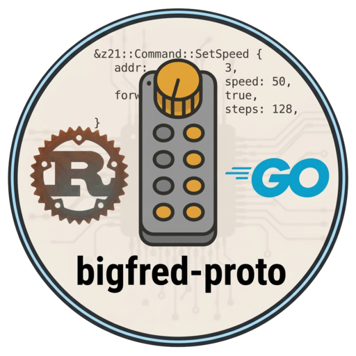

# dcc-bigfred-proto-railcom

<p align="center">
  
</p>

RailCom (**RCN-217**) protocol parser: 4-of-8 codes, channel datagrams, and DYN telemetry. `#![no_std]`, no `alloc`, no sockets, no Z21/LocoNet/WiThrottle.

A detector feeds 4-of-8 bytes with [`Update::Encoded`]. A command station that already decoded the cutout (Z21 LAN `0x88`) feeds [`Update::Address`] and [`Update::Dyn`]. [`Parser::snapshot`] returns [`LocoTelemetryData`].

Use **one [`Parser`] per decoder**. Mobile (locomotive) is the default; [`Parser::stationary`] treats channel 1 as a 12-bit SRQ with no identifier (RCN-217 STAT). After ACK/NACK, further bytes on that channel are ignored until [`Parser::begin_cutout`]. Identifiers whose payload is not decoded (XPOM, zeit, …) still consume the Table 6/7 length so the rest of the cutout stays aligned.

## Install

```toml
[dependencies]
dcc-bigfred-proto-railcom = "0.1"
```

## Usage

```rust
use dcc_bigfred_proto_railcom as railcom;

let mut p = railcom::Parser::new();
p.begin_cutout();
p.ingest(railcom::Update::Address(13))?;
p.ingest(railcom::Update::Dyn {
    subindex: 0,
    value: 80,
})?;
let d = p.snapshot();
assert_eq!(d.address, Some(13));
assert_eq!(d.speed_kmh, Some(80));
```

Raw cutout byte (Table 2 code, start/stop stripped):

```rust
p.ingest(railcom::Update::Encoded {
    channel: railcom::Channel::Two,
    byte: 0x0F, // ACK
})?;
```

Z21 LAN is **not** a raw cutout. Enable `dcc-bigfred-proto-z21`’s `railcom` feature and use `Client::on_bytes_with_railcom` — that crate maps `LAN_RAILCOM_DATACHANGED` onto this parser. Full Table 13 (tanks, temperature, voltage) needs encoded channel-2 bytes, which Z21 does not forward.

## Docs

- [RCN-217 RailCom](https://github.com/dcc-bigfred/proto/blob/main/docs/protos/rcn-217.md)
- [Rust protocol guide](https://github.com/dcc-bigfred/proto/blob/main/docs/rust/README.md)

## License

Apache-2.0
